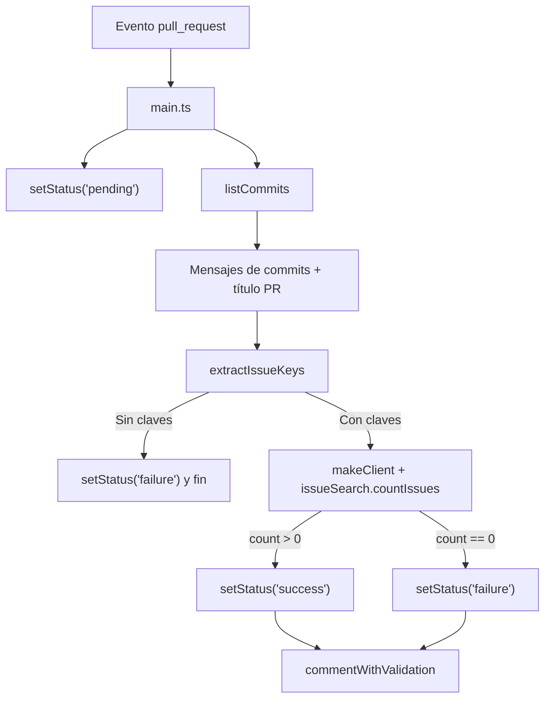

# Jira Automation Convention Checker

## Descripción
Esta GitHub Action valida Pull Requests para garantizar:
1. Cumplimiento de convenciones de commits orientadas a CI/CD (tipo `feat:`, `fix:`, etc.).
2. Presencia y validez de claves de issues de Jira (formato `ABC-123`).
3. Recomendaciones de merge según el título y los commits (Squash vs Merge). 
4. Publica un comentario estructurado en el Pull Request con el estado de las validaciones y crea un commit status ("Jira Issue Validation").

## ¿Cómo funciona?
Al dispararse en un evento `pull_request`:
1. Obtiene el token de GitHub y las credenciales de Jira de los `inputs`.
2. Recupera los commits del PR y el título.
3. Extrae claves de Jira (`extractIssueKeys`).
4. Valida si existen dichas claves y consulta a la API de Jira para confirmar que las issues existen.
5. Determina el tipo de versión potencial (major/minor/patch) inspeccionando mensajes (BREAKING CHANGE, feat, fix, etc.).
6. Construye y publica un comentario detallado en el PR (actualiza si ya existe uno previo con marcador `<!-- issue-validator -->`).
7. Crea/actualiza un `commit status` con el resultado de la validación de issues.

## Entradas (`action.yml`)
| Input | Requerido | Descripción | Default |
|-------|-----------|-------------|---------|
| `token` | opcional (pero recomendado) | GitHub Access Token para llamadas a la API y comentar | `${{ github.token }}` |
| `jira_email` | sí | Email del usuario con acceso a Jira | - |
| `jira_api_token` | sí | API Token generado en Jira | - |
| `jira_host` | no (en código se usa si está) | Host de Jira; por defecto `https://andreani.atlassian.net` | - |

## Salidas
Actualmente la Action no define salidas explícitas, pero:
- Crea un comentario en el PR con validaciones.
- Establece un commit status (context: `Jira Issue Validation`).

## Convenciones soportadas para versionado
La función `determineReleaseType` inspecciona cada mensaje de commit:
- `BREAKING CHANGE` o `breaking: true` -> `major`
- Prefijos `feat` / `FEAT` -> `minor`
- Prefijos o indicadores `fix`, `BUGFIX`, `SECURITY`, emojis (:bug:, :racehorse:, etc.), `ref`, `styles`, `perf`, `FIX` -> `patch`

## Ejemplo de uso en workflow
```yaml
name: PR Validation
on:
  pull_request:
    types: [opened, synchronize, edited]

jobs:
  validations:
    runs-on: ubuntu-latest
    steps:
      - uses: actions/checkout@v4
      - name: Jira Convention Check
        uses: infrastructure-services/continuos-integration@validations
        with:
          token: ${{ secrets.GITHUB_TOKEN }}
          jira_email: ${{ secrets.JIRA_EMAIL }}
          jira_api_token: ${{ secrets.JIRA_API_TOKEN }}
```

## Arquitectura de módulos
- `main.ts`: Orquestador. Valida evento, reúne commits, extrae issues, consulta Jira, setea commit status y llama a `commentWithValidation`.
- `jira.ts`: Construye clientes V2 y V3 de Jira (`jira.js`) con autenticación básica y hooks de logging.
- `utils.ts`: `extractIssueKeys` para encontrar claves Jira usando regex genérico (`\b[A-Z][A-Z0-9]*-\d+\b`).
- `comment.ts`: Genera/actualiza comentario con resumen de CI/CD, JIRA y versionado potencial.
- `definitions.d.ts`: Tipado externo para integración con plugin `@architecture-it/semantic-release-jira` (posible uso futuro).

## Flujo resumido
```
pull_request -> main.ts
  |-> listCommits (GitHub API)
  |-> extrae claves (utils.ts)
  |-> consulta Jira (jira.ts client3.issueSearch.countIssues)
  |-> setStatus (success/failure)
  |-> commentWithValidation (comment.ts)
```

## Diagrama de Flujo


## Documentación funcional
- **`src/main.ts`**: Orquesta la validación del PR, publica estados (`pending/success/failure`) y crea/actualiza el comentario. Ver [docs/main.md](docs/main.md).
- **`src/jira.ts`**: Expone `makeClient` para autenticar y consultar Jira (V2/V3) con middlewares de logging. Ver [docs/jira.md](docs/jira.md).
- **`src/utils.ts`**: `extractIssueKeys` para extraer claves de Jira desde título/commits con regex genérico. Ver [docs/utils.md](docs/utils.md).
- **`src/comment.ts`**: Construye comentario detallado en español con validaciones de CI/CD y JIRA, y determina el tipo de versión (`major|minor|patch`). Ver [docs/comment.md](docs/comment.md).
- **`src/definitions.d.ts`**: Declaraciones de tipos para integración futura con `semantic-release-jira`. Ver [docs/definitions.md](docs/definitions.md).

## Documentación de `comment.ts`
- Resumen detallado del módulo, parámetros, validaciones y ejemplo de uso: ver [docs/comment.md](docs/comment.md).

