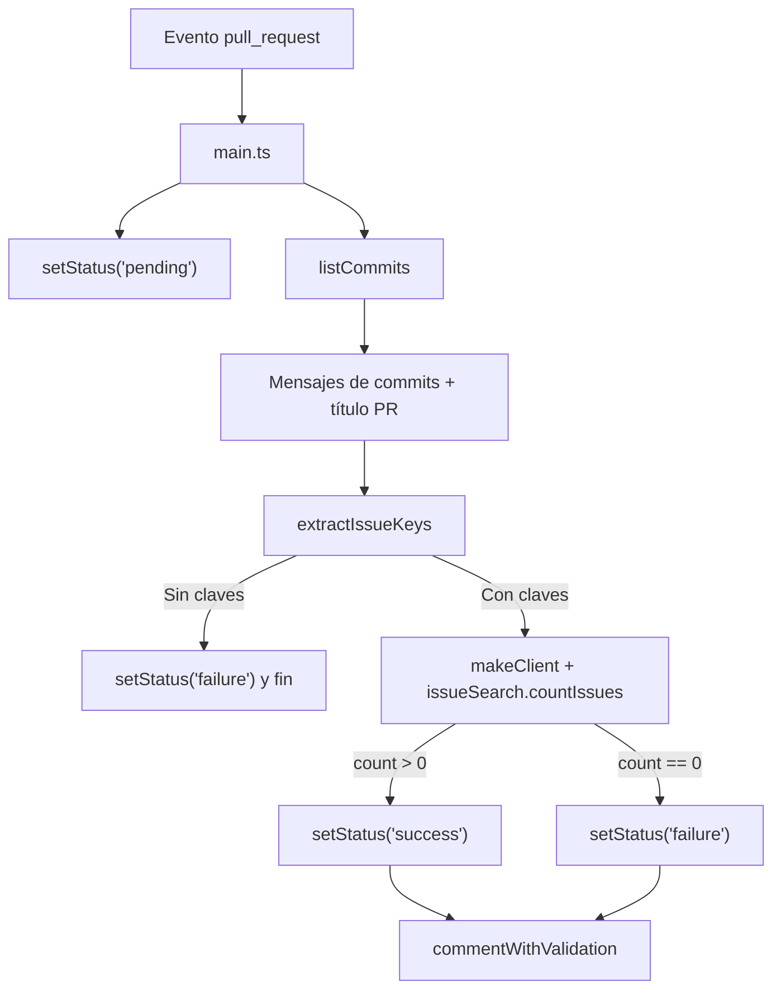

# Documentación de `src/main.ts`

## Propósito
- Orquestar la validación de un Pull Request:
  - Buscar claves de Jira en el título y los commits.
  - Consultar Jira para confirmar existencia de issues.
  - Publicar un `commit status` con el resultado (pending/success/failure).
  - Generar/actualizar un comentario detallado en el PR.

## Flujo
1. Valida que el evento sea `pull_request` (si no, finaliza con `warning`).
2. Obtiene `token` y credenciales de Jira desde `inputs` (`github_token`, `jira_email`, `jira_api_token`).
3. Construye `octokit` y obtiene datos del PR (título, número, branch).
4. Publica `setStatus(..., 'pending', ...)` mientras analiza.
5. Recupera commits del PR (`listCommits`) y agrega el título a los mensajes.
6. Extrae claves con `extractIssueKeys(messages)`.
7. Si no hay claves -> `failure` y retorna.
8. Crea clientes de Jira con `makeClient(host, email, token)`.
9. Consulta Jira V3 (`issueSearch.countIssues`) con las claves encontradas.
10. Si `count === 0` -> `failure`; si hay coincidencias -> `success`.
11. Llama a `commentWithValidation(prTitle, branchName, octokit)` para publicar/actualizar el comentario.
12. Manejo de errores: `core.setFailed(...)` y `setStatus(..., 'failure', ...)`.

## Entradas
- `github_token` (requerido): Token de GitHub para API y comentarios.
- `jira_email` (requerido): Email con acceso a Jira.
- `jira_api_token` (requerido): API token de Jira.
- Host de Jira: Fijado en código a `https://andreani.atlassian.net`.

## Estado del Commit (`setStatus`)
- Parámetros:
  - `state`: `success` | `failure` | `pending`.
  - `description`: Texto breve del estado.
  - `context`: Nombre del check, por defecto `Jira Issue Validation`.
- Publica un `status` sobre el `sha` del PR usando `octokit.rest.repos.createCommitStatus`.

## Errores y Logging
- Usa `core.info`, `core.warning`, `core.error` para telemetría.
- `getErrorMessage(error)` normaliza errores a `string`.
- Middlewares de Jira logean errores/respuestas si se provee `logger`.

## Ejemplo de Resultado
- `success`: "Found N matching Jira issues." y comentario con validaciones.
- `failure`: "No Jira issue keys found..." o "No matching Jira issues found." o error de configuración/llamadas.

## Diagrama de Flujo

